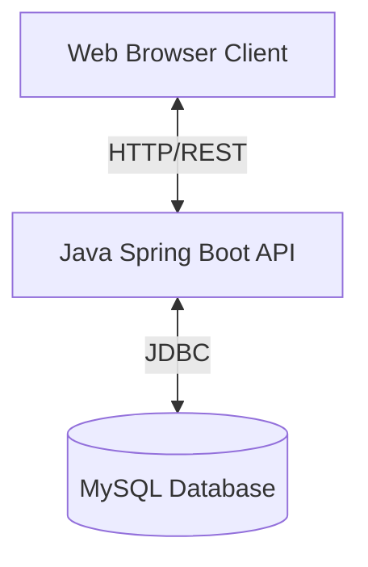

# Placement Preparation Tracker - Architecture Document

## 1. High-Level System Architecture

The **Placement Preparation Tracker (PrepSphere)** is designed as a decoupled, full-stack web application. It follows a classic 3-tier architecture, ensuring clear separation of concerns, scalability, and ease of maintenance.

The three primary tiers are:
1.  **Presentation Tier (Frontend):** A modern Single Page Application (SPA) built with React.
2.  **Application Tier (Backend):** A RESTful API server built with Java and Spring Boot.
3.  **Data Tier (Database):** A relational database (MySQL) for persistent data storage.



---

## 2. System Directory Structure

The repository is structured to cleanly separate the frontend UI from the backend Java APIs.

```text
PlacementPreparationTracker/
├── docs/                                  # Documentation and architecture diagrams
├── prepsphere-frontend/                   # React Frontend Application
│   ├── public/                            # Static assets
│   └── src/
│       ├── api/                           # API service calls (fetch/axios)
│       ├── assets/                        # Images, icons, fonts
│       ├── components/                    # Reusable UI components (Sidebar, Layout)
│       ├── hooks/                         # Custom React hooks
│       └── pages/                         # Route-level views (Dashboard, DSA, Projects)
└── src/                                   # Java Backend Application
    └── main/
        └── java/com/placementtracker/
            ├── achievement/               # Achievement tracking module
            ├── app/                       # Main application entry and configurations
            ├── application/               # Job/Internship application tracking module
            ├── common/                    # Shared utilities, models, and exceptions
            ├── database/                  # JDBC Database configuration and connections
            ├── dsa/                       # DSA progress tracking module
            ├── goal/                      # Goal setting module
            ├── project/                   # Portfolio project tracking module
            ├── reports/                   # Reporting and analytics logic
            ├── resume/                    # Resume management module
            ├── study/                     # Study streak tracking module
            └── timer/                     # Focus session timer logic
```

---

## 3. Frontend Architecture (PrepSphere Frontend)

The frontend is located in the `prepsphere-frontend` directory and is built to deliver a highly responsive user experience.

*   **Core Library:** **React 19**
*   **Build Tool:** **Vite** (provides lightning-fast Hot Module Replacement and optimized production builds).
*   **Styling:** **Tailwind CSS** (utility-first CSS framework for rapid UI development).
*   **Routing:** **React Router DOM** (handles client-side routing without full page reloads).

### Component Structure
The frontend is component-driven, organized primarily into:
*   **Pages (`src/pages/`):** Top-level views mapped to routes (e.g., `Dashboard.jsx`, `DSA.jsx`, `Projects.jsx`, `Applications.jsx`).
*   **Components (`src/components/`):** Reusable UI elements (e.g., `Sidebar.jsx`, `Layout.jsx`).

**Data Flow:** The frontend consumes REST endpoints exposed by the Java backend using standard `fetch` or `axios` calls (typically abstracted in `src/api/` or custom hooks in `src/hooks/`).

---

## 4. Backend Architecture (Java Application)

The backend is a robust Java application situated in the `src/main/java/com/placementtracker` directory. While it utilizes the **Spring Boot** wrapper (`@SpringBootApplication`) to bootstrap the application and serve endpoints, the internal business logic strictly adheres to traditional Object-Oriented patterns and the **Controller-Service-Repository** pattern.

### Layered Design

1.  **Controller Layer (API Routing / UI Router)**
    *   Historically managed via a console-based `MenuRouter`, this layer is responsible for receiving user input/HTTP requests, delegating tasks to the Service layer, and returning the appropriate response.
2.  **Service Layer (Business Logic)**
    *   Classes like `DSAService` and `ProjectService` contain the core business rules.
    *   They utilize Java 8+ **Streams API** and **Predicates** for complex in-memory data filtering and processing (e.g., `advancedSearch`).
    *   They enforce validations and throw custom or standard Java Exceptions.
3.  **Repository Layer (Data Access)**
    *   Classes like `DSARepository` and `ProjectRepository` handle all interactions with the database.
    *   This layer isolates SQL queries and data mapping logic from the business logic.

### Modularity
The backend is highly modularized by feature domain. As shown in the directory structure, each feature (`dsa`, `project`, `resume`, etc.) is self-contained within its own package.

### Key Design Patterns Used
*   **Singleton/Dependency Injection:** Spring Boot manages bean lifecycles.
*   **Data Access Object (DAO):** The Repository classes act as DAOs, abstracting database operations.
*   **Encapsulation & POJOs:** Domain models (e.g., `Project`, `Problem`) encapsulate state and behavior strictly.

---

## 5. Data Architecture (Database Tier)

Data persistence is handled by a **MySQL** relational database.

### Connection and Access
*   **JDBC (Java Database Connectivity):** The application connects to MySQL using raw JDBC instead of an ORM (like Hibernate).
*   **DatabaseConnection Utility:** A centralized configuration (`DatabaseConfig.java` / `DatabaseConnection.java`) manages connection strings and credentials.
*   **Prepared Statements:** The repositories exclusively use `PreparedStatement` to execute SQL queries, preventing SQL injection vulnerabilities.

### Data Mapping
The Repository layer uses custom `mapRow(ResultSet rs)` methods to manually map SQL rows to strongly-typed Java objects.

---

## 6. Summary of Tech Stack

| Layer | Technology | Purpose |
| :--- | :--- | :--- |
| **Frontend** | React, Vite, TailwindCSS | Client-side UI, routing, and state management. |
| **Backend** | Java 21, Spring Boot Core | Business logic execution, REST API exposure. |
| **Data Access** | JDBC, Java Collections | Executing SQL queries and aggregating data. |
| **Database** | MySQL | Persistent, relational data storage. |
